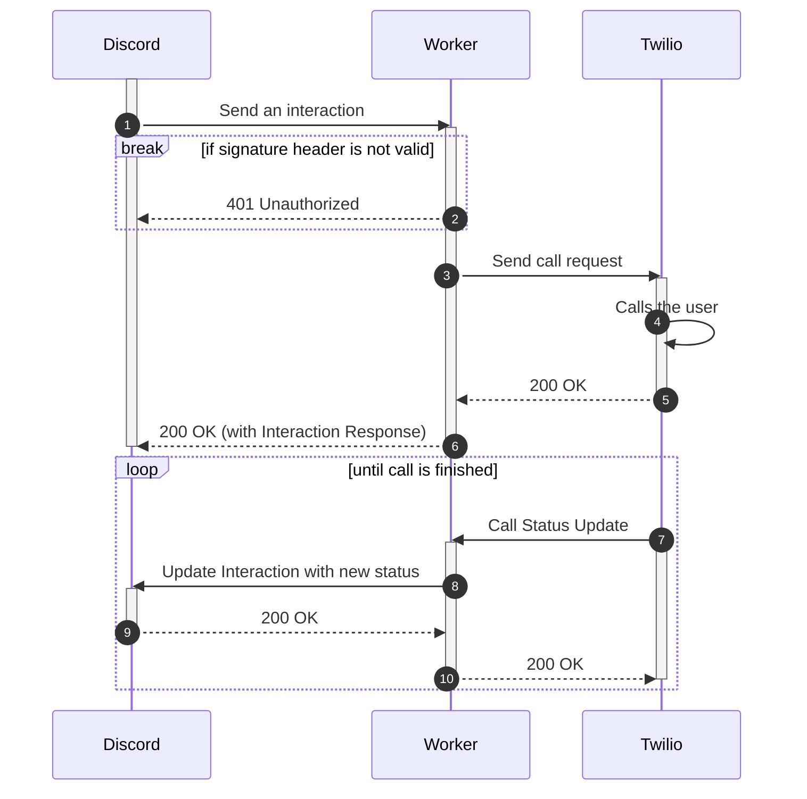

# Discord Phone Worker 

A Discord application to call your phone (yes, your actual phone) through Twilio in case of emergencies.

<!-- todo gif -->

## Usage examples

* If you're managing some form of service, like a webserver or Discord bot then your staff can call your cellphone if it's down.
* If a server you're admin in is getting raided and you're not available, they can call your cellphone to let you know.

Generally, it's a way for other Discord members to contact you through your phone. The main purpose is to be even more available, like when you don't have Wi-Fi/celluar data availale.

## Setting up with Workers

1. [Deploy with Workers](https://deploy.workers.cloudflare.com/?url=https://github.com/biaw/phone)
2. Insert the environment variables listed in the [`wrangler.toml`](https://github.com/biaw/phone/blob/main/wrangler.toml) file. You can either use the `wrangler` command, or do it through the worker dashboard.
3. Edit the Discord application and set the interactions endpoint to `https://phone.YOUR_CF_WORKERS_SUBDOMAIN.workers.dev/interaction`. This is where the bot will receive interactions.
4. Add the bot by visiting `/invite`. Make sure to uncheck "Public bot" in the Discord Developer portal so other people can't add it to servers you don't want to have access to call you.

## How calling works

## Pricing

As you can see in the GIF above, it does cost money because of Twilio, and it really depends on your location, the Twilio phone number's location etc. - but a free trial at Twilio will probably get you a long way already.

I think it's obvious enough... but I will not pay for your phone number.