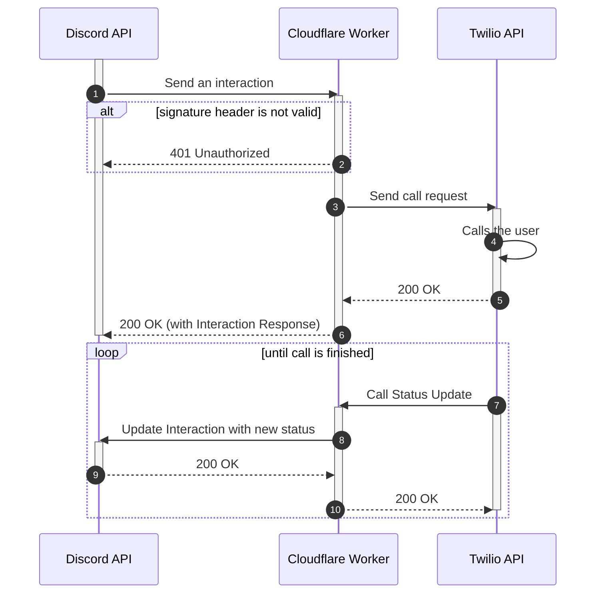

<picture>
  <source media="(prefers-color-scheme: dark)" srcset="https://socialify.git.ci/biaw/phone/image?custom_language=Discord&description=1&font=Inter&forks=1&language=1&name=1&owner=1&pattern=Plus&stargazers=1&theme=Dark&logo=https%3A%2F%2Fwww.svgrepo.com%2Fshow%2F354472%2Ftwilio-icon.svg">
  
</picture>

# Explanation

Are you one of those people who are always available on Discord? Do you want to be even more available? Then this bot is for you! This small Cloudflare Worker allows your fellow Discord friends to call your cellphone, for example if you manage a service and it goes down, or if you're an admin in a server that is getting raided. The main purpose is to be even more available, like when you don't have Wi-Fi/cellular data available.

  
Click to see a GIF of the `/call` command in action

  <!-- todo make this into a video (#167) -->

  

# Setting up with Cloudflare Workers

1. Deploy to Cloudflare Workers using the button above.
2. Insert the environment variables listed in the [`wrangler.toml`](https://github.com/biaw/phone/blob/main/wrangler.toml) file. You can either use the `wrangler` command, or do it through the worker dashboard.
3. Edit the Discord application and set the interactions endpoint to `https://phone.WORKER_SUBDOMAIN.workers.dev/interaction`. This is where the bot will receive interactions.
4. Go to `https://phone.WORKER_SUBDOMAIN.workers.dev/update-commands?key=DISCORD_PUBLIC_KEY` to update and register the `/call` slash command.
5. Add the bot by visiting `/invite`. Make sure to uncheck "Public bot" in the Discord Developer portal so other people can't add it to servers you don't want to have access to call you.
6. It might take some time before the command appears because of Discord's caching, but you should be able to use the `/call` command within the hour!

## How calling works

## Pricing

It might cost a tiny little bit of money after you've used up your free trial at Twilio. The amount really depends on your location, the Twilio phone number's location etc. - but the free trial will probably get you a long way already.

I think it's obvious enough... but I will not pay for your phone number.
